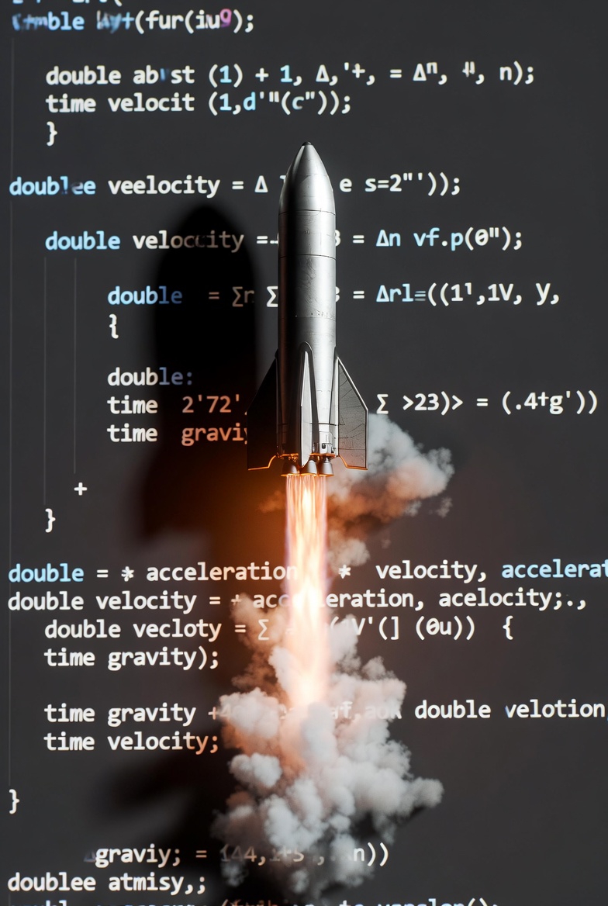

# Autonomous Rocket Engineering Simulation : Icarus

**Objective:** Progressive development of rocket landing simulation and controls, from 1-DOF to 6-DOF.

<p align="center">
  
</p>

---

## Roadmap

**Phase 1**: 1-DOF Vertical Landing (Complete)
- Cascade PID control (position -> velocity)
- RK4 numerical integration
- Runtime JSON configuration
- Systematic parameter tuning

**Phase 2**: 3-DOF Dynamics
- Lateral (x, y) position control
- Trajectory planning
- Wind disturbance modeling

**Phase 3**: Advanced Control
- Model Predictive Control (MPC)
- Kalman filtering / state estimation
- Performance comparison: PID vs MPC

**Phase 4**: 6-DOF Full Dynamics
- Quaternion-based rotation
- Thrust Vector Control (TVC)
- Coupled translation + rotation

**Phase 5**: Reinforcement Learning
- PPO agent for adaptive landing
- COmparison: Classical vs RL control

---

## Quick Start
```bash
make
./build/Icarus
```