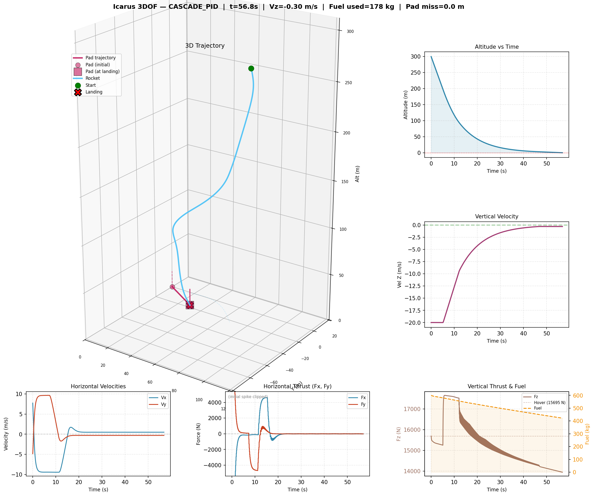

# Autonomous Rocket Engineering Simulation: Icarus

<p align="center">
  
</p>

**Icarus** (named after the figure from Greek mythology who flew too close to the sun) is a simulation-only rocket vertical landing project. It is the algorithmic counterpart to [Talos](https://github.com/abhi/ARES-Talos), a physical self-balancing robot. Because there is no hardware constraint, Icarus prioritizes algorithmic depth — progressing from classical PID control through optimal control and reinforcement learning.

The project serves as a rigorous study of controls theory and C++ engineering, benchmarked against the academic papers that underpin real rocket guidance systems (Acikmese, Szmuk, Blackmore).

<p align="center">
  
</p>

_Phase 1.5 cascade PID controller: 3-DOF powered descent from 300 m with wind disturbances and a moving landing pad. Outer loops (position → reference velocity) run at 0.1–0.3 s; inner loops (velocity → thrust) at 0.02–0.1 s. The rocket intercepts and lands on the drifting pad with sub-metre precision._

---

## Architecture

<p align="center">
  
</p>

- The simulation is written in C++17, using [Eigen](https://eigen.tuxfamily.org/) for linear algebra and [RK4](https://en.wikipedia.org/wiki/Runge%E2%80%93Kutta_methods) numerical integration. 
- The codebase follows a GNC (Guidance, Navigation, Control) separation designed to scale through MPC and RL phases without structural rewrites. 
- Configuration is loaded at runtime from JSON. Results are written to CSV for Python-based analysis.

## Quick Start

```bash
make run        # configure + build + execute
./build/Icarus  # run directly after build
```

---

## Roadmap

| Phase | Goal | Status |
|---|---|---|
| **1** | 1-DOF cascade PID vertical landing | Complete |
| **1.5** | 3-DOF translation: wind disturbances, moving landing pad | Complete |
| **1.75** | Classical stability analysis of Phase 1.5 closed-loop system | Complete |
| **2** | Add Euler angle rotation dynamics (6 DOF, TVC) | Next |
| **2.5** | Upgrade to quaternions — singularity-free attitude control | Upcoming |
| **3a** | LTV-MPC: linearize along reference trajectory, OSQP solver | Upcoming |
| **3b** | Successive Convexification (SCvx) — matches SpaceX approach | Upcoming |
| **4** | Reinforcement Learning: PPO/SAC agent, compare vs. MPC | Future |

---

## Phase 1.5: 3-DOF Translation (Complete)

Extends cascade control to 3D space without rotation. Thrust direction is commanded directly as a force vector — no attitude dynamics yet.

### State and Control

```
State:   [x, y, z, vx, vy, vz, fuel_mass]   (7D)
Control: [Fx, Fy, Fz]                        (direct force vector, N)
```

### Cascade Architecture

```
Vertical:   Outer (0.1s):  z error  →  ref_vz   →  Inner (0.02s): vz error → Fz
Horizontal: Outer (0.3s):  xy error →  ref_vxy  →  Inner (0.1s):  vxy error → Fx, Fy
```

Dual cascade loops run at different timescales. Rate-limiters on each outer loop prevent large setpoint steps from causing thrust pulsing.

### Environment

- **Wind**: constant bias + sinusoidal gust model (`wind_x=3 m/s`, `gust_magnitude=2 m/s`)
- **Moving pad**: drifting at constant velocity (`0.5 m/s`, `-0.3 m/s`), intercepted at landing

### Results

| Metric | Value |
|---|---|
| Landing Velocity (Z) | **−0.30 m/s** |
| Landing Velocity (X/Y) | **(0.50, −0.30) m/s** |
| Pad miss distance | **< 0.1 m** |
| Flight Time | 56.9 s |
| Fuel Used | 178 kg of 600 kg |
| Initial Condition | (120, −80, 300) m, (8, −5, −20) m/s |

### Key Learnings
- Cascade control separates timescales: vertical and horizontal loops can be tuned independently
- **Anti-windup is non-negotiable**: without conditional integration, accumulated integral permanently saturates reference velocity
- **Rate-limiting the outer loop command** eliminates thrust pulsing from setpoint steps
- Gravity feedforward (hover force) eliminates steady-state vertical velocity error without relying on the integral term

---

## Phase 1.75: Stability Analysis (Complete)

Classical linear stability analysis of the Phase 1.5 closed-loop system — linearized around hover trim, analytical Jacobian, eigenvalue analysis, Bode plots, root locus, and robustness sweep across the full fuel range.

<p align="center">
  
</p>

- **Vertical loop is linearly unstable** around hover trim across the entire mass range — the empirically-tuned cascade PID gains violate the [Routh-Hurwitz stability condition](https://en.wikipedia.org/wiki/Routh%E2%80%93Hurwitz_stability_criterion). The sim succeeds because the rocket never dwells near hover trim and nonlinear effects (anti-windup, rate limiting) bound the instability in practice.
- **Horizontal loop is stable but critically under-damped** — phase margin ≈ 0.7°, consistent with near-purely-imaginary eigenvalues and very slow decay of perturbations.
- **Both results are robust to mass** — stability character does not change from full-fuel to dry, because all characteristic polynomial coefficients scale uniformly with `1/m`.
- Motivates model-based control in Phase 3, where closed-loop stability is enforced by construction rather than empirical tuning.

Full derivations and plots: [`docs/stability_analysis.md`](docs/stability_analysis.md)

---

## Phase 1: 1-DOF Vertical Landing (Complete)

The first phase implements cascade PID control for 1-DOF powered descent — starting from a terminal-descent handoff condition (300 m altitude, -20 m/s) and landing with near-zero velocity.

```
State:   [altitude, velocity, fuel_mass]
Control: throttle ∈ [0, 1]
```

---

## Upcoming Phases

### Phase 2–2.5: Rotation Dynamics

Phase 2 introduces full rotational dynamics via Euler angles (roll, pitch, yaw) with gimbal-based thrust vector control. Phase 2.5 replaces Euler angles with quaternions to eliminate gimbal lock — the aerospace industry standard.

### Phase 3: Optimal Control (MPC + SCvx)

Replaces the PID cascade with optimal control. Phase 3a uses Linear Time-Varying MPC (linearize dynamics along a reference trajectory, solve a QP at each step). Phase 3b implements Successive Convexification — the approach used in SpaceX's Falcon 9 guidance — based on the foundational work of Acikmese et al.

Key insight: **lossless convexification** relaxes the nonconvex thrust cone constraint to a convex form whose optimal solution satisfies the original constraint exactly.

### Phase 4: Reinforcement Learning

Trains a PPO or SAC agent on the 6-DOF environment. Compares learned policy against MPC on landing success rate, fuel efficiency, and robustness to domain randomization (mass uncertainty, wind, thrust noise).
