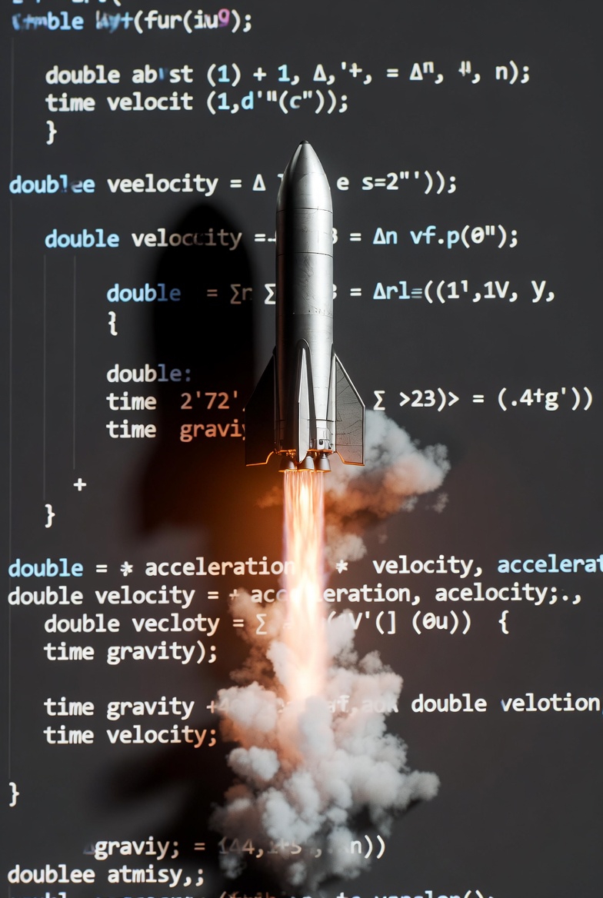
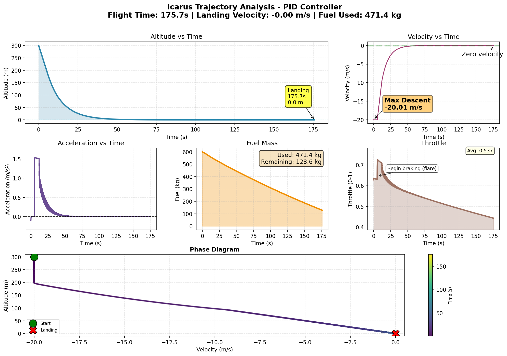
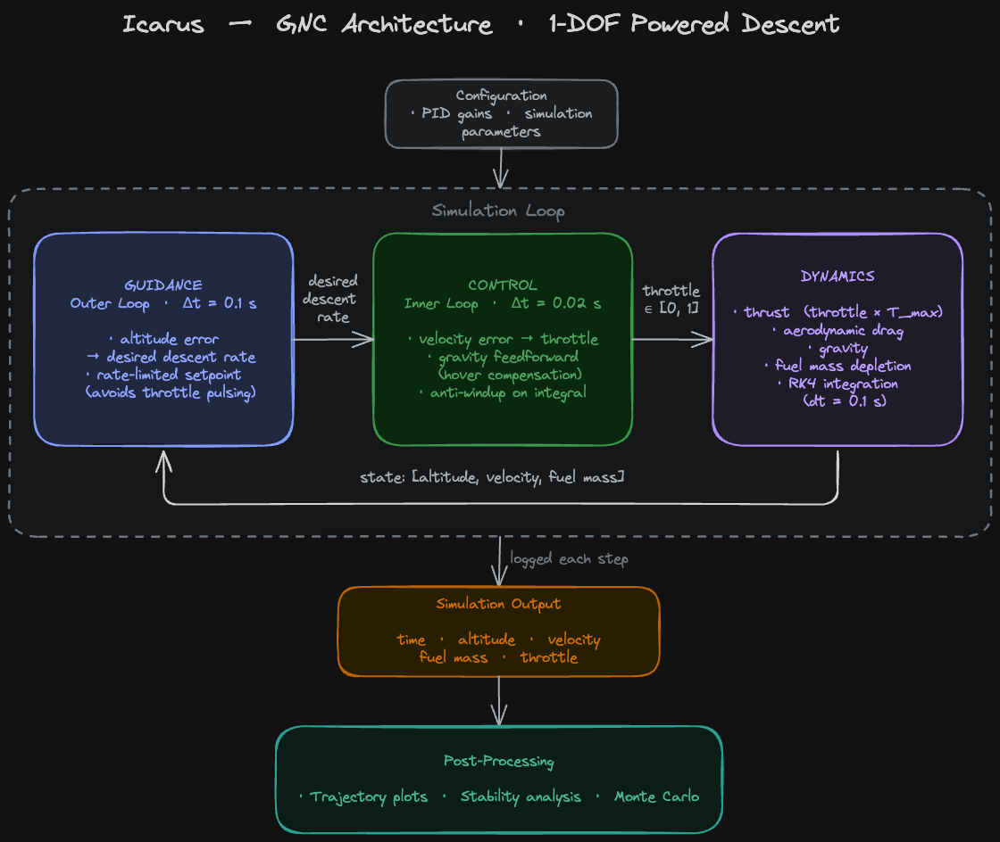

# Autonomous Rocket Engineering Simulation: Icarus

<p align="center">
  
</p>

**Icarus** (named after the figure from Greek mythology who flew too close to the sun) is a simulation-only rocket vertical landing project. It is the algorithmic counterpart to [Talos](https://github.com/abhi/ARES-Talos), a physical self-balancing robot. Because there is no hardware constraint, Icarus prioritizes algorithmic depth — progressing from classical PID control through optimal control and reinforcement learning.

The project serves as a rigorous study of controls theory and C++ engineering, benchmarked against the academic papers that underpin real rocket guidance systems (Acikmese, Szmuk, Blackmore).

<p align="center">
  
</p>

_This plot shows the Phase 1 controller: a cascaded PID where the outer loop turns altitude error into a desired descent rate (reference velocity), and the inner loop tracks that reference velocity by commanding throttle (with gravity feedforward). The reference velocity is rate-limited to avoid large setpoint steps that cause throttle pulsing._

---

## Architecture

<p align="center">
  
</p>

- The simulation is written in C++17, using [Eigen](https://eigen.tuxfamily.org/) for linear algebra and [RK4](https://en.wikipedia.org/wiki/Runge%E2%80%93Kutta_methods) numerical integration. 
- The codebase follows a GNC (Guidance, Navigation, Control) separation designed to scale through MPC and RL phases without structural rewrites. 
- Configuration is loaded at runtime from JSON. Results are written to CSV for Python-based analysis.

## Quick Start

```bash
make run        # configure + build + execute
./build/Icarus  # run directly after build
```

---

## Phase 1: 1-DOF Vertical Landing (Complete)

The first phase implements cascade PID control for 1-DOF powered descent — starting from a terminal-descent handoff condition (300 m altitude, -20 m/s) and landing with near-zero velocity.

### State and Control

```
State:   [altitude, velocity, fuel_mass]
Control: throttle ∈ [0, 1]
```

### Cascade Architecture

```
Outer loop (0.1s period): altitude error  →  ref_velocity
Inner loop (0.02s period): velocity error  →  throttle
```

The outer loop frequency is critical: it should be slower than the inner loop, but fast enough to avoid large setpoint steps; this repo also rate-limits the commanded reference velocity to reduce throttle pulsing.

### Results

| Metric | Value |
|---|---|
| Landing Velocity | **~0 m/s** (< 1e-6 m/s) |
| Initial Condition | 300 m, −20 m/s (terminal-descent handoff) |
| Fuel Remaining | ~125 kg of 600 kg |
| Flight Time | ~175 s |

### Key Learnings
- Cascade control separates timescales: position loop sets the target descent rate, velocity loop tracks it
- **Anti-windup is non-negotiable**: without conditional integration, the position loop's integral accumulates over the full flight and permanently saturates the reference velocity
- **Rate-limiting the outer loop command** (not just slowing the loop) eliminates throttle pulsing from setpoint steps
- Gravity feedforward (hover throttle compensation) eliminates steady-state velocity error without relying on the integral term

---

## Roadmap

| Phase | Goal | Status |
|---|---|---|
| **1** | 1-DOF cascade PID vertical landing | Complete |
| **1.5** | 3-DOF translation: wind disturbances, moving landing pad | Next |
| **2** | Add Euler angle rotation dynamics (6 DOF, TVC) | Upcoming |
| **2.5** | Upgrade to quaternions — singularity-free attitude control | Upcoming |
| **3a** | LTV-MPC: linearize along reference trajectory, OSQP solver | Upcoming |
| **3b** | Successive Convexification (SCvx) — matches SpaceX approach | Upcoming |
| **4** | Reinforcement Learning: PPO/SAC agent, compare vs. MPC | Future |

### Phase 1.5: 3-DOF Translation

Extends cascade control to 3D space without rotation. Thrust direction is commanded directly (no attitude dynamics yet). Adds:
- Wind disturbance model (constant + sinusoidal gusts)
- Moving landing pad tracking (drone ship analogy)
- Thrust magnitude saturation: `||F|| ≤ F_max`

### Phase 2–2.5: Rotation Dynamics

Phase 2 introduces full rotational dynamics via Euler angles (roll, pitch, yaw) with gimbal-based thrust vector control. Phase 2.5 replaces Euler angles with quaternions to eliminate gimbal lock — the aerospace industry standard.

### Phase 3: Optimal Control (MPC + SCvx)

Replaces the PID cascade with optimal control. Phase 3a uses Linear Time-Varying MPC (linearize dynamics along a reference trajectory, solve a QP at each step). Phase 3b implements Successive Convexification — the approach used in SpaceX's Falcon 9 guidance — based on the foundational work of Acikmese et al.

Key insight: **lossless convexification** relaxes the nonconvex thrust cone constraint to a convex form whose optimal solution satisfies the original constraint exactly.

### Phase 4: Reinforcement Learning

Trains a PPO or SAC agent on the 6-DOF environment. Compares learned policy against MPC on landing success rate, fuel efficiency, and robustness to domain randomization (mass uncertainty, wind, thrust noise).
