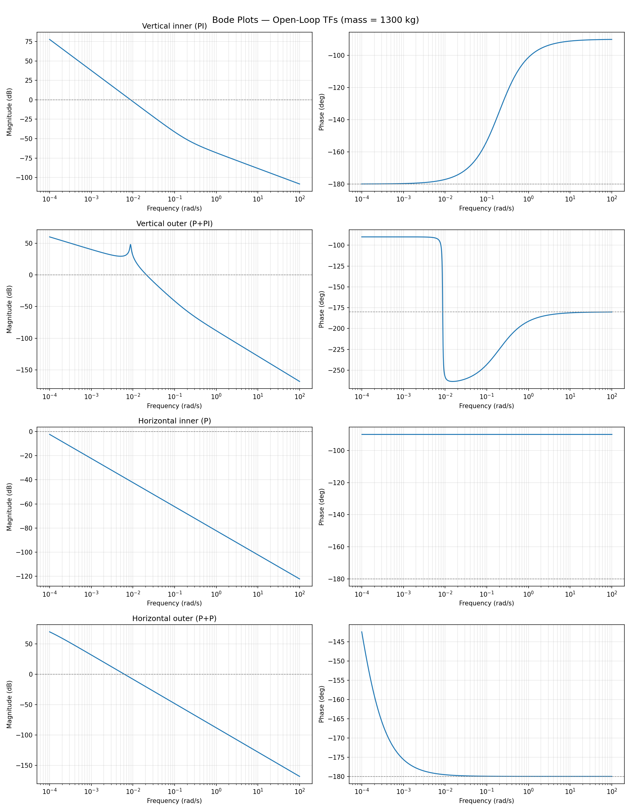
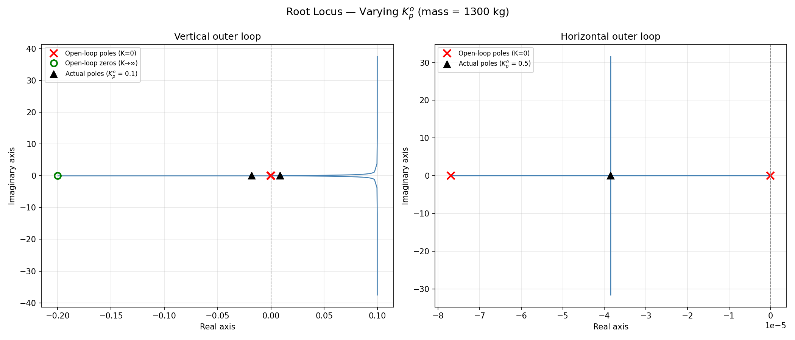
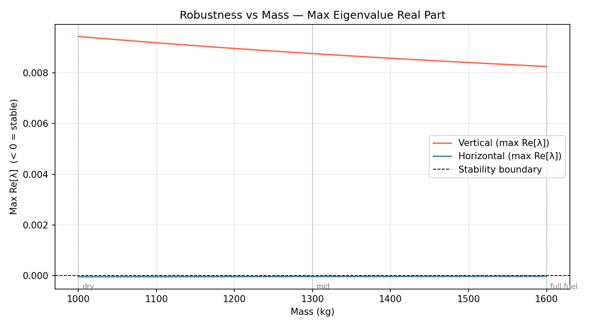
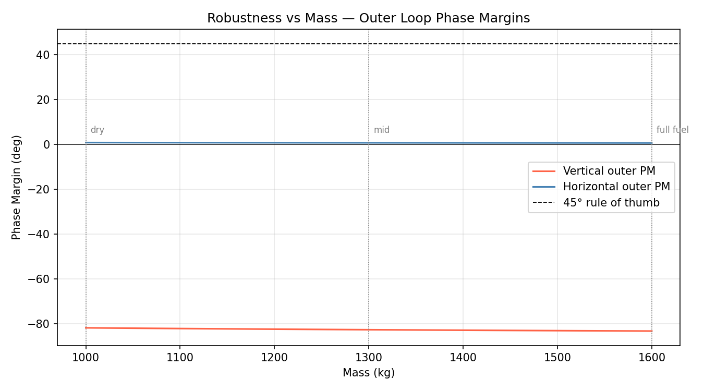

# 3DOF Stability Analysis

## Open-Loop
The 3DOF state and control vectors are: 

$$
\begin{aligned}
x &= [p_x, p_y, p_z, v_x, v_y, v_z, m]\\
u &= [F_x, F_y, F_z]
\end{aligned}
$$

System dynamics: 

$$
\dot{x} = f(x, u)
$$

$$
\begin{gathered}
\dot{p}_x = v_x, \space\dot{p}_y = v_y, \space\dot{p}_z = v_z\\
\dot{v}_x = F_x/m, \space\dot{v}_y = F_y/m, \space\dot{v}_z = (F_z - mg)/m\\
\dot{m} = \frac{-||F||}{F_{max}}\cdot {\dot{m}_{max}}
\end{gathered}
$$

>[!NOTE]
> We will treat $m$ as a slowly varying parameter, not a state.
> We will analyze stability at a fixed $m$, then check how stability margins change across the mass range (a.k.a robustness analysis). 

Hence, we have the revised state vector:

$$
x = [p_x, p_y, p_z, v_x, v_y, v_z]
$$

### Equilibrium
At equilibrium we have: $\dot{x} = 0$. 

Hence, we get:

$$
\begin{gathered}
v_x = v_y = v_z = 0\\
F_x = F_y = 0\\
F_z = mg
\end{gathered}
$$

>[!IMPORTANT]
> We also have $p_z = p_z^*$ which means altitude (position in z-direction) can take any reference value.

>[!Tip]
> The equilibrium condition is also called the _Trim_ condition, especially in aerospace literature.

>[!NOTE]
> Vertical and horizontal dynamics are decoupled in open-loop; i.e., $(p_i, v_i)$ only depend on $F_i$, $\forall i\in (x, y, z)$. 
> - Hence we can analyze 3 independent 2D subsytems instead of a single 6D system.
> - Even in closed-loop, there are 3 decoupled 2D loops. 
> - Moreover, since $x$ and $y$ are structurally identical, we only need to analyze 2 independent 2D subsytems. 
>   - Vertical loop: different gains, different timescales, and with feedforward.
>   - Horizontal loop: representative of both $x$ and $y$.

> [!IMPORTANT]
> Stability analysis is for linear systems only.
> 
> Strictly speaking, our system is nonlinear because:
> - $m$ varies,
> - PID has saturation and a rate-limiter on the outer loop.

### Perturbation Analysis
Perturbation around Trim (subtract equilibrium condition from current condition to get perturbation):

$$
\begin{gathered}
\delta p_z = p_z - p_z^*\\
\delta v_z = v_z - 0\\
\delta F_z = F_z - mg
\end{gathered}
$$

Substituting in system dynamics, we get the perturbation dynamics:

$$
\begin{aligned}
\delta\dot{p}_z &= v_z = \delta v_z\\
\delta\dot{v}_z &= F_z/m - g = \delta F_z/m
\end{aligned}
$$

This gives us a _double integrator_.

>[!NOTE]
> Double Integrator:
>   - A system where the input is integrated twice to produce the output.
>   - Transfer function: $1/s^2$, i.e., two poles at the origin. 
>   - A double integrator is _marginally stable_ open-loop (i.e., without control), i.e., poles on the imaginary axis and not in the left-half plane.
> 
> For rockets, this means that the control input force should be the second derivative of the output position: 
>   - $p \xrightarrow{d/dt} v \xrightarrow{d/dt} a = F/m$.

>[!Tip]
> - _Asymptotically stable_: perturbations decay back to 0.
> - _Marginally stable_: drifts forever, perturbation neither grows nor decays.
> - _Unstable_: perturbation grows without bound.

### Jacobian
For vertical subsystem, $x = [\delta p_z, \delta v_z]$ and $u = \delta F_z$.

Linearized dynamics should be: $\dot{x} = Ax + Bu$, where $A = \frac{\partial f}{\partial x}$, $B = \frac{\partial f}{\partial u}$.

Perturbed dynamics become:

$$
\begin{bmatrix}
\delta\dot{p}_z\\
\delta\dot{v}_z
\end{bmatrix} =
\begin{bmatrix}
0 & 1\\
0 & 0
\end{bmatrix}
\begin{bmatrix}
\delta p_z\\
\delta v_z
\end{bmatrix}
+
\begin{bmatrix}
0\\
1/m
\end{bmatrix}
\delta F_z
$$

## Closed-Loop

### Vertical Subsystem
Controller contributions in Phase 1.5:

$$
\begin{aligned}
v_z^{ref} &= K_p^o \cdot (p_z^* - p_z) = -K_p^o \space \delta p_z \space\space\rightarrowtail \text{outer loop}\\
\delta F_z &= K_p^i(v_z^{ref} - \delta v_z) + K_i^i\int (v_z^{ref} - \delta v_z)\,dt \space\space \rightarrowtail \text{inner loop}
\end{aligned}
$$

>[!NOTE]
> $\delta p_z$: deviation of position from trim $p_z=0$, which is also what the outer loop wants.
> 
> $\delta v_z$: deviation of velocity from trim $v_z=0$, but inner loop wants to track to reference velocity not make it zero.

Substituting, we get:

$$
\delta F_z = K_p^i(-K_p^o\delta p_z - \delta v_z) + K_i^i\int (-K_p^o\delta p_z - \delta v_z)\,dt
$$

Because of integrator memory, we need to define a new state $x = [\delta p_z, \delta v_z, \xi]$, where the integrator state $\xi$ is:

$$
\xi = \int (v_z^{ref} - \delta v_z)\,dt = \int (-K_p^o\delta p_z - \delta v_z)\,dt
$$

with dynamics:

$$
\dot{\xi} = -K_p^o\delta p_z - \delta v_z
$$

Closed-loop dynamics (vertical) become $\dot{x} = A_{cl}x$:

$$
\begin{bmatrix}
\delta\dot{p}_z\\\\
\delta\dot{v}_z\\\\
\dot{\xi}
\end{bmatrix} =
\begin{bmatrix}
0 & 1 & 0\\\\
-K_p^iK_p^o/m & -K_p^i/m & K_i^i/m\\\\
-K_p^o & -1 & 0
\end{bmatrix}
\begin{bmatrix}
\delta p_z\\\\
\delta v_z\\\\
\xi
\end{bmatrix}
$$

>[!IMPORTANT]
> Eigenvalues of $A_{cl}$ determine closed-loop stability, i.e., all 3 must have negative real part.

### Horizontal Subsystem
State $x = [\delta p_x, \delta v_x]$. No feedforward ($F_x^{ff} = 0$; unlike the vertical loop there is no gravity to compensate in the horizontal direction).

Controller contributions in Phase 1.5:

$$
\begin{aligned}
v_x^{ref} &= -K_p^o \delta p_x\\
\delta F_x &= K_p^i(v_x^{ref} - \delta v_x) = K_p^i(-K_p^o\delta p_x - \delta v_x)
\end{aligned}
$$

Closed loop dynamics (horizontal) become $\dot{x} = A_{cl}x$:

$$
\begin{bmatrix}
\delta \dot{p}_x\\\\
\delta \dot{v}_x
\end{bmatrix} =
\begin{bmatrix}
0 & 1\\\\
-K_p^iK_p^o/m & -K_p^i/m
\end{bmatrix}
\begin{bmatrix}
\delta p_x\\\\
\delta v_x
\end{bmatrix}
$$

>[!NOTE]
> Because of no integrator term, the horizontal loop cannot reject steady-state disturbances like constant wind. This is expected and acceptable in Phase 1.5 since wind is treated as a disturbance.

## Eigenvalue Analysis

Numerical eigenvalues computed in `analysis/stability/linearize.py` at mid-flight mass ($m = m_{dry} + m_{fuel}/2 = 1300$ kg):

**Horizontal** (2nd order, P outer + P inner cascade):
$$\lambda_{1,2} \approx -3.85 \times 10^{-5} \pm 0.0062j$$

Both eigenvalues have negative real part $\Rightarrow$ **stable**, but barely — very slow damping.

**Vertical** (3rd order, PI inner + P outer):
$$\lambda_{1,2} \approx +0.0088 \pm 0.0188j, \quad \lambda_3 \approx -0.0179$$

Two eigenvalues have positive real part $\Rightarrow$ **unstable** around hover trim.

### Interpretation

The Routh-Hurwitz condition for the 3rd-order vertical system requires:

$$\frac{K_p^i}{m}\left(\frac{K_p^i K_p^o}{m} + \frac{K_i^i}{m}\right) > \frac{K_i^i}{m} \cdot K_p^o$$

With the Phase 1.5 gains this evaluates to $4.44 \times 10^{-8} > 7.69 \times 10^{-6}$, which is **false**. The integrator gain $K_i^i$ combined with the outer gain $K_p^o$ is too large relative to the damping term.

>[!IMPORTANT]
> **The sim works despite linear instability.** Two reasons:
> 1. The rocket never operates near hover trim — it is always descending on a reference trajectory, far from the equilibrium we linearized around. Linear stability analysis is only valid locally around trim.
> 2. Anti-windup and rate limiting are nonlinear effects that prevent the linear instability from growing in practice.
>
> This means the Phase 1.5 gains were tuned empirically for the nonlinear trajectory, not designed for linear stability. This motivates systematic gain design in Phase 3 (MPC), where stability is guaranteed by construction.

## Frequency Response (Bode Analysis)

Eigenvalue analysis tells us whether the system is stable, but not _how_ stable — i.e., how much gain or phase change it can tolerate before going unstable. Bode analysis answers this via **gain margin** and **phase margin**.

This requires working with **transfer functions** rather than state-space matrices.

### From Differential Equations to Transfer Functions

The key tool is the **Laplace transform**, which converts linear ODEs into algebraic equations in the complex variable $s$:

$$\mathcal{L}\{\dot{x}(t)\} = s \cdot X(s), \qquad \mathcal{L}\left\{\int x \, dt\right\} = \frac{X(s)}{s}$$

So differentiation becomes multiplication by $s$, and integration becomes division by $s$. Any linear ODE can be rearranged to give a **transfer function**: the ratio of output to input in the $s$-domain.

>[!NOTE]
> Transfer functions only apply to linear, time-invariant systems. This is why linearization (Section 1) is a prerequisite.

### Building Blocks

Each element in the cascade loop has a transfer function:

- **Plant (inner)**: maps force input to velocity output. From $\delta\dot{v} = \delta F / m$, taking the Laplace transform: $s \cdot V(s) = F(s)/m$, so the inner plant is:
$$P(s) = \frac{1}{ms}$$

- **PI controller** (vertical inner): proportional term contributes $K_p^i$, integral term contributes $K_i^i / s$. Combined:
$$C_{inner}^{vert}(s) = K_p^i + \frac{K_i^i}{s} = \frac{K_p^i s + K_i^i}{s}$$

- **P controller** (horizontal inner, both outers): constant gain only — $C(s) = K_p$.

- **Position integrator**: velocity → position via $\dot{p} = v$, so $s \cdot P_{pos}(s) = V(s)$, giving a $1/s$ factor in the outer loop plant.

### Transfer Functions

**Step 1 — Vertical inner open-loop TF** ($L_{inner}^{vert}$):

$$L_{inner}^{vert}(s) = C_{inner}^{vert}(s) \cdot P(s) = \frac{K_p^i s + K_i^i}{s} \cdot \frac{1}{ms} = \frac{K_p^i s + K_i^i}{ms^2}$$

**Step 2 — Vertical inner closed-loop TF** ($T_{inner}^{vert}$):

Standard unity-feedback formula $T = L / (1 + L)$, simplified:

$$T_{inner}^{vert}(s) = \frac{K_p^i s + K_i^i}{ms^2 + K_p^i s + K_i^i}$$

**Step 3 — Vertical outer open-loop TF** ($L_{outer}^{vert}$):

Outer plant = closed inner loop × position integrator. Outer controller = $K_p^o$:

$$L_{outer}^{vert}(s) = K_p^o \cdot \frac{T_{inner}^{vert}(s)}{s} = \frac{K_p^o (K_p^i s + K_i^i)}{s(ms^2 + K_p^i s + K_i^i)}$$

**Step 4 — Horizontal inner open-loop TF** ($L_{inner}^{horiz}$):

Inner controller is P-only ($K_p^i$ for horizontal), same plant:

$$L_{inner}^{horiz}(s) = \frac{K_p^i}{ms}$$

**Step 5 — Horizontal inner closed-loop TF** ($T_{inner}^{horiz}$):

$$T_{inner}^{horiz}(s) = \frac{K_p^i}{ms + K_p^i}$$

**Step 6 — Horizontal outer open-loop TF** ($L_{outer}^{horiz}$):

$$L_{outer}^{horiz}(s) = K_p^o \cdot \frac{T_{inner}^{horiz}(s)}{s} = \frac{K_p^o K_p^i}{s(ms + K_p^i)}$$

>[!NOTE]
> The open-loop TFs ($L_{inner}$, $L_{outer}$) are what go into Bode plots and margin calculations.
> The closed-loop TFs ($T_{inner}$) are intermediate results needed to construct the outer loop.

### Stability Margins

Given an open-loop TF $L(s)$, evaluate it along the imaginary axis $s = j\omega$:

- **Gain crossover frequency** $\omega_{gc}$: where $|L(j\omega)| = 1$ (i.e., 0 dB).
- **Phase crossover frequency** $\omega_{pc}$: where $\angle L(j\omega) = -180°$.

Then:

$$\text{Phase Margin} = 180° + \angle L(j\omega_{gc})$$
$$\text{Gain Margin} = \frac{1}{|L(j\omega_{pc})|}$$

Rule of thumb for robust stability: $GM > 6$ dB, $PM > 45°$.

>[!NOTE]
> For an unstable open-loop system, gain/phase margin from Bode alone can be misleading — the Nyquist criterion is more rigorous. But for our (nominally stable) horizontal loop, Bode margins are the right tool. For vertical, we compute them anyway to quantify _how_ unstable the gain/phase relationship is.

### Numerical Computation

Implemented in `analysis/stability/frequency_response.py` using the `python-control` library.

Transfer functions are constructed with `control.tf(num, den)`, closed-loop via `control.feedback(L, 1)`, and margins via `control.margin(L)` which returns $(GM, PM, \omega_{gc}, \omega_{pc})$.

### Bode Plots

All four plots are evaluated at mid-flight mass $m = 1300$ kg.

**Vertical inner loop** ($L_{inner}^{vert}$, PI controller):

- Magnitude rolls off at $-40$ dB/decade — consistent with two poles at the origin ($1/s^2$ behavior) dominating at high frequency.
- Phase starts near $-180°$ at low frequencies (two integrators dominate) and rises to $-90°$ at high frequencies (the PI zero $s = -K_i^i / K_p^i$ provides phase lead).
- The phase never dips below $-180°$, so the inner loop open-loop TF does not have a phase crossover — gain margin is effectively infinite for this loop in isolation.

**Vertical outer loop** ($L_{outer}^{vert}$, P outer + closed PI inner):

- Phase has a pronounced dip, going well below $-180°$ (reaching approximately $-240°$) before recovering.
- This means there is a finite phase crossover frequency $\omega_{pc}$ where $\angle L = -180°$, and the gain is still above 0 dB at that point — confirming **negative gain margin** and an **unstable loop**.
- This is consistent with the eigenvalue result: two RHP eigenvalues in the closed-loop vertical system.
- The dip is caused by the interaction between the PI zero (which provides phase lead in the inner loop) and the outer integrator and P gain wrapping phase around.

**Horizontal inner loop** ($L_{inner}^{horiz}$, P controller):

- Magnitude is a straight $-20$ dB/decade line — a pure gain-scaled integrator $K_p^i / (ms)$.
- Phase is constant at $-90°$ across all frequencies — a single integrator always gives exactly $-90°$ of phase lag.
- Phase never reaches $-180°$, so gain margin is infinite. Phase margin is $90°$ — very robust.

**Horizontal outer loop** ($L_{outer}^{horiz}$, P outer + closed P inner):

- Phase starts around $-145°$ at low frequencies and asymptotically approaches $-180°$ without ever crossing it — gain margin is therefore infinite.
- The gain crossover frequency occurs at $\omega \gg K_p^i/m$ (well above the inner loop pole), where $T_{inner}^{horiz}$ has already rolled off and $L_{outer}^{horiz}$ behaves like a double integrator. At that frequency the phase is nearly $-180°$, giving a phase margin of only $\approx 0.7°$.
- The asymptotic approach to $-180°$ is expected: relative degree 2 at high frequency means phase must approach $-180°$.

>[!IMPORTANT]
> **Summary of margins:**
> - Vertical inner: infinite GM, PM $\approx 90°$ — well-conditioned inner loop.
> - Vertical outer: **negative GM**, PM $\approx -83°$ — unstable, consistent with RHP eigenvalues.
> - Horizontal inner: infinite GM, PM $= 90°$ — robust.
> - Horizontal outer: infinite GM, PM $\approx 0.7°$ — technically stable but critically under-damped.
>
> The near-zero phase margin of the horizontal outer loop directly explains the eigenvalue result $\lambda \approx -3.85 \times 10^{-5} \pm 0.0062j$: nearly purely imaginary poles mean the system is oscillating and barely decaying.

## Root Locus

Root locus shows how closed-loop poles move in the $s$-plane as the outer gain $K_p^o$ is swept from $0$ to $\infty$, with the inner loop held fixed. This answers: *is there any value of $K_p^o$ that stabilizes the loop, and where does the actual operating gain sit relative to the stability boundary?*

The loop is written as $L(s) = K_p^o \cdot G(s)$, where $G(s) = T_{inner}(s)/s$ with $K_p^o$ factored out. Closed-loop poles are roots of $1 + K_p^o \cdot G(s) = 0$.

**Vertical outer loop** (left panel):

- At $K=0$ (red ×), the open-loop poles sit near the origin — the inner closed-loop poles close to zero, plus the outer integrator pole at $s=0$.
- As $K_p^o$ increases, one branch moves left toward the PI zero in the deep LHP ($s \approx -0.2$) — this branch is stabilizing. The other two branches form a complex pair that immediately veer into the RHP.
- At the actual gain $K_p^o = 0.1$ (black triangles), the complex pair sits at $+0.009 \pm 0.019j$ — in the RHP — confirming instability.
- Crucially, the complex branches enter the RHP for any non-zero $K_p^o$. **There is no stabilizing value of $K_p^o$ with the current inner gains.** The instability is structural: the PI integrator gain $K_i^i$ combined with this outer gain structure violates Routh-Hurwitz regardless of how $K_p^o$ is tuned. Fixing it requires retuning the inner loop, not the outer.

**Horizontal outer loop** (right panel):

- Open-loop poles at $\approx 0$ (integrator) and $\approx -8 \times 10^{-5}$ (inner closed-loop pole), both on or near the real axis.
- No open-loop zeros, so both branches go to $\pm j\infty$ as $K_p^o \to \infty$.
- At the actual gain $K_p^o = 0.5$ (triangle), the poles sit at $\approx -3.85 \times 10^{-5} \pm 0.0062j$ — a complex conjugate pair barely in the LHP. The imaginary component is small relative to the plot scale, so they appear nearly real on the figure.
- The root locus stays in the LHP for small gains but the complex branches eventually cross into the RHP at large $K_p^o$ — the horizontal loop can be destabilized by gain that is too high.

## Robustness vs Mass

Mass changes from $m_{dry} = 1000$ kg (no fuel) to $m_{full} = 1600$ kg (full fuel) over the flight. All analysis so far was at mid-flight mass $m = 1300$ kg. Here we sweep the full range and track stability properties.

Implemented in `analysis/stability/robustness.py`.

**Numerical summary** (computed at three operating points):

| Mass | Re[$\lambda$]$_{vert}$ | Re[$\lambda$]$_{horiz}$ | PM$_{vert}$ | PM$_{horiz}$ |
|---|---|---|---|---|
| Dry (1000 kg) | +0.00944 | −0.00005 | −81.9° | +0.81° |
| Mid (1300 kg) | +0.00878 | −0.00004 | −82.7° | +0.71° |
| Full fuel (1600 kg) | +0.00826 | −0.00003 | −83.3° | +0.64° |

**Key findings:**

1. **Vertical instability is robust to mass** — the most unstable eigenvalue stays positive across the entire mass range, ranging from $+0.0094$ (dry) to $+0.0083$ (full). The vertical loop is unstable throughout the flight, with *slightly worse* instability at low fuel (higher acceleration sensitivity at lower mass).

2. **Horizontal stability is equally robust** — the maximum real part stays negative across all masses, meaning the horizontal loop remains stable (barely) regardless of fuel state.

3. **Phase margins are nearly flat vs mass** — vertical PM stays near $-83°$, horizontal PM stays near $0.7°$. Mass has almost no effect on the margin values.

>[!NOTE]
> The near-independence on mass is expected. The characteristic polynomial of $A_{cl}$ has the form:
> $$s^3 + \frac{K_p^i}{m} s^2 + \frac{K_i^i + K_p^i K_p^o}{m} s + \frac{K_i^i K_p^o}{m} = 0$$
> Every coefficient has $m$ in the denominator, so increasing mass uniformly scales all coefficients down. The eigenvalues (roots) scale approximately as $1/m$ in magnitude, but their signs — and therefore which are in the RHP — do not change. The same argument holds for the horizontal 2nd-order characteristic polynomial.

>[!IMPORTANT]
> **Phase 1.75 overall conclusion:** The Phase 1.5 cascade PID gains are linearly unstable around hover trim (vertical loop) and critically under-damped (horizontal loop), across the full mass range. The simulation succeeds because the rocket never dwells near hover trim and nonlinear effects bound the instability. This motivates model-based gain design in Phase 3, where stability is enforced by construction rather than empirical tuning.